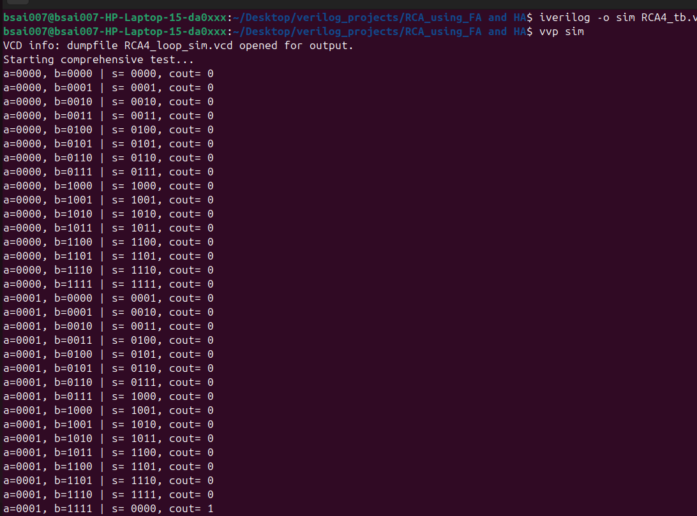

# 4-Bit Ripple Carry Adder (RCA) in Verilog

This repository contains a structural gate-level implementation of a **4-Bit Ripple Carry Adder (RCA)** in Verilog. The project is hierarchically designed, starting from primitive logic gates up to a full 4-bit addition circuit, and includes a comprehensive self-checking testbench matrix.

---

## 🚀 Project Architecture

The design is split into three hierarchical levels:
1. **`HA.v` (Half Adder):** Built structurally using primitive `xor` and `and` gates[**`HA.v`**](./HA.v).
2. **`FA.v` (Full Adder):** Implemented by cascading two Half Adders (`HA`) and an `or` gate[**`FA.v`**](./FA.v).
3. **`RCA4.v` (4-Bit Ripple Carry Adder):** Chains four Full Adder (`FA`) modules together to handle 4-bit parallel addition.

---

### block diagram:-
```text
                  +-------------------------------------------------+
                  |                   RCA4 Module                   |
                  |                                                 |
         c0 ------>---> FA0 ------> FA1 ------> FA2 ------> FA3 ------> cout
                  |      |           |           |           |      |
a[3:0] ----------->======+===========+===========+===========+====== |
b[3:0] ----------->======+===========+===========+===========+====== |
                  |      v           v           v           v      |
                  |     s[0]        s[1]        s[2]        s[3]    |
                  +-------------------------------------------------+

```
---

#### output and results:

the following commands are entered to get the outputs in the terminal:
1. **```iverilog -o rca4sim RCA4_tb.v```** : Here I have already included rca4.v in tb file itself so it is not required to type in command.And also since we have also mentioned HA.v and FA.v in the files, they are also not required to enter in the command.

2.**```vvp rca4.sim ```** : This command lets the files run and if there are any outputs ao statements to be displayed, it will be printed in the terminal.


the image shows some of the statements displayed. when you run the file it displays all combinations of 4 bit inputs and corresponding cout and sum.

3.**```gtkwave RCA4_loop_sim.vcd```** : If you wish to observe the waveforms in gtkwave, use this command. I have written to sump the waveforms to RCA4_loop_sim.vcd file in RCA4_tb.v file. if you wish to rename, you can do it in the file, but remember to keep the format as .vcd or else gtkwave won't run.