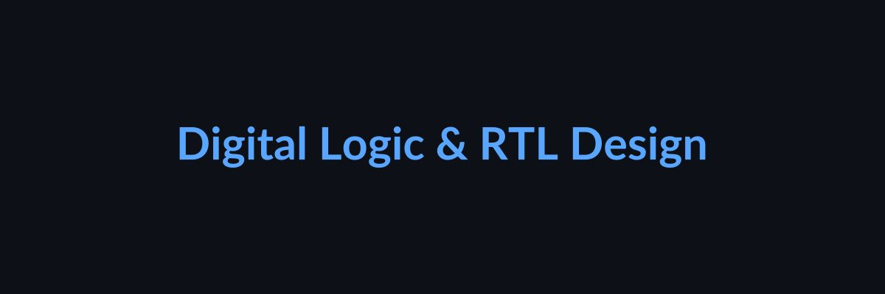

# Verilog Learning Journey
My collection of hardware designs and simulations.
I have done these projects in my Ubuntu system, using VS Code, Icarus Verilog, and GTKWave.
It is expected to have an Ubuntu system with GTKWave, Icarus Verilog, and VS Code installed to run these projects locally.

# Projects
1. [Logic Gates Intro](./logic_gates_intro)
2. [Half Adder](./half_adder)
3. [Full Adder](./full_adder)
4. [2:1 Mux (Dataflow)](./mux_2to1_df/)
5. [2:1 Mux (Behavioral)](./mux_2to1_bh/)
6. [4:1 Mux](./mux_4to1_circ/)
7. [4 Bit Ripple Carry Adder(RCA)](./RCA_4bit/)
8. [Flip Flops](./flip_flops/)
9. [4 bit RCA using FA and HA](./RCA_using_FA_and_HA/)
10. [counters using flip flops(synchronous)](./counters_using_flip_flops/)
11. [Code convereters](./code_converters/)
12. [Up/Down Counter](./up_down_counter/)