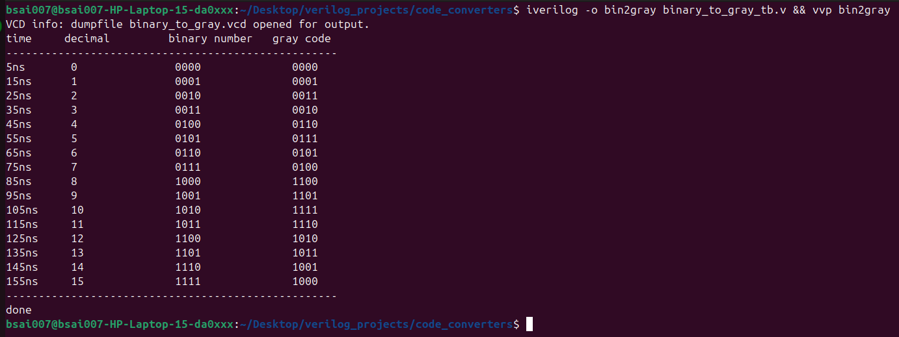
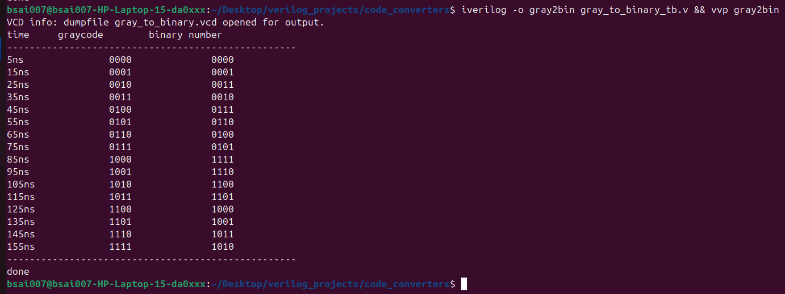
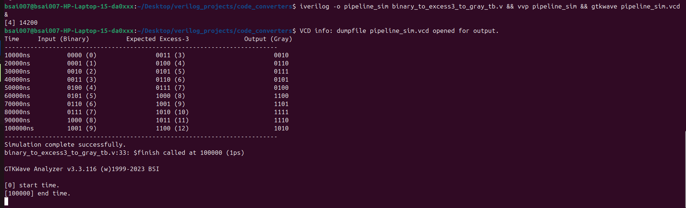
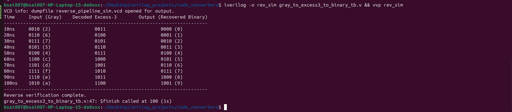

# Code Converters

In this project, binary to gray codes are being explored.

# Digital Code Converters Pipeline

A collection of Verilog HDL hardware modules implementing standalone and multi-stage code converters. This project contains structural logic designs and testbenches to convert between standard Binary, Gray Code, and Excess-3 representations, fully verified using Icarus Verilog and GTKWave.

---

## 📂 Project Structure

```text
code_converters_pipeline/
├── binary_to_gray.v                 # Standalone Binary to Gray converter
├── binary_to_gray_tb.v              # Testbench for Binary to Gray logic
├── gray_to_binary.v                 # Standalone Gray to Binary converter
├── gray_to_binary_tb.v              # Testbench for Gray to Binary logic
├── binary_to_excess3_to_gray.v     # Top-level forward pipeline (Add 3 -> Gray)
├── binary_to_excess3_to_gray_tb.v  # Testbench for the forward pipeline
├── gray_to_excess3_to_binary.v     # Top-level reverse pipeline (Gray -> Sub 3)
└── gray_to_excess3_to_binary_tb.v  # Testbench for the reverse pipeline


```
## ⚙️ Design Methodologies

### 1. Forward Pipeline (Binary ➡️ Excess-3 ➡️ Gray)
* **Concept:** Takes a raw 4-bit binary input vector representing decimal values 0 to 9.
* **Operation:** 
  1. Offsets the binary value into the Excess-3 domain by adding `4'b0011`.
  2. Instantiates the `binary_to_gray` module to directly encode the intermediate Excess-3 bit pattern into its corresponding Gray code.
* **Example:** Input `0101` (5) $\rightarrow$ Intermediate `1000` (8) $\rightarrow$ Output `1100` (`0xC`).

### 2. Reverse Pipeline (Gray ➡️ Excess-3 ➡️ Binary)
* **Concept:** Takes a 4-bit Gray code stream and reconstructs the original decimal value.
* **Operation:**
  1. Instantiates the `gray_to_binary` sub-module to decode the raw Gray bits back into the Excess-3 space.
  2. Subtracts `4'b0011` from the intermediate wire to extract the true, original binary number.
* **Example:** Input `1100` (`0xC`) $\rightarrow$ Intermediate `1000` $\rightarrow$ Output `0101` (5).

---

## 🚀 Simulation & Verification

This project is developed and verified natively on Ubuntu Linux using the Icarus Verilog (`iverilog`) compiler toolchain and GTKWave for visual waveform debugging.

### Compiling and Running Simulations

To run sequential compilation and execution in a single terminal line, execute the following commands inside your workspace directory:

#### For the Forward Pipeline:
```verilog
iverilog -o pipeline_sim binary_to_excess3_to_gray_tb.v && vvp pipeline_sim
```

#### For the Reverse Pipeline:
```verilog
iverilog -o rev_sim gray_to_excess3_to_binary_tb.v && vvp rev_sim
```
#### For testing binary to gray 
This can be run separately using its _tb.v file:
```verilog
iverilog -o bin2gray binary_to_gray_tb.v && vvp bin2gray
```
##### this is conditional
to watch the waveforms in gtkwave,
```verilog
gtkwave binary_to_gray.vcd
```
#### For testing gray to binary
This can be done separately using its _tb.v file:
```verilog
iverilog -o gray2bin gray_to_binary_tb.v && vvp gray2bin && gtkwave gray_to_binary.vcd
```
## 💻 Expected Terminal Outputs

When running the simulations via `vvp`, the console display logs verify the functionality of both pipelines over the complete decimal range (0-9):

binary to gray terminal output:



gray to binary output:


excess3 to gray output:



gray to excess 3 output:

