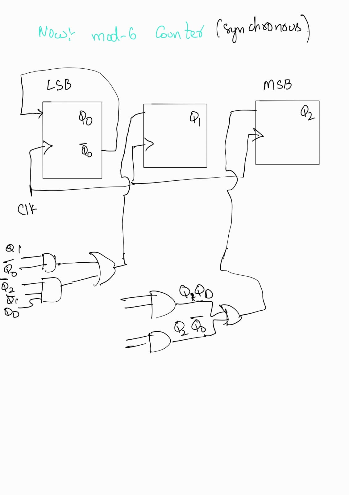
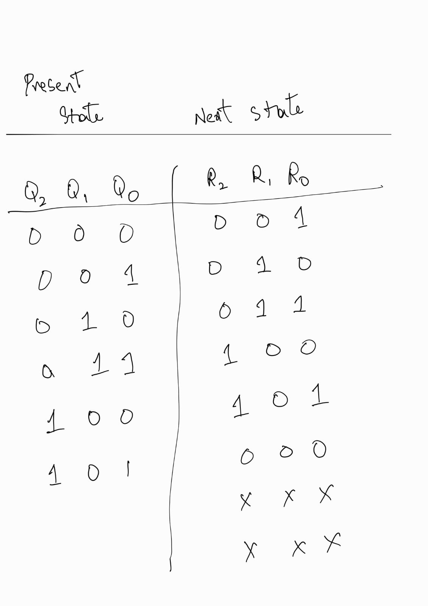
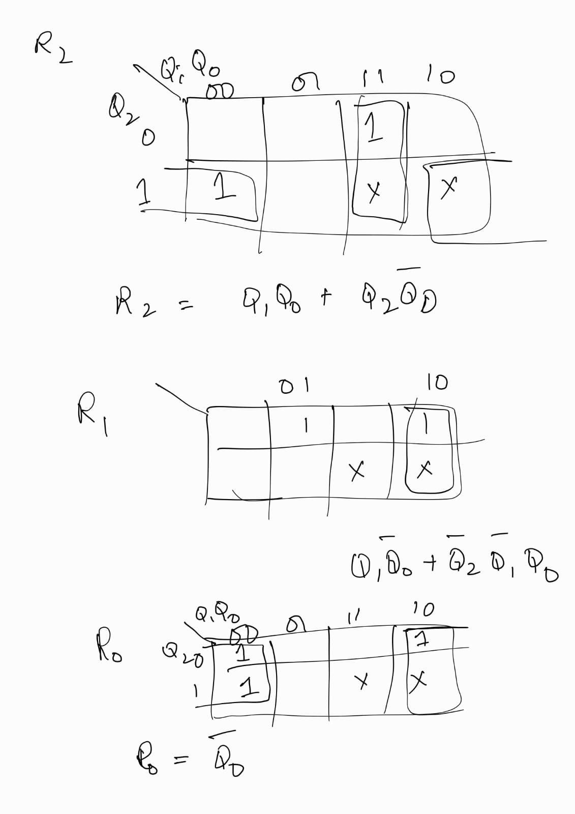
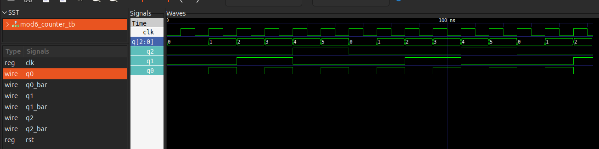

# Counters 
Counters can be implemented using flip flops. Here, I have implemented a synchronous counter using D flip-flops.

---

# Circuit Diagram
Below is the hardware circuit schematic used


---

# Truth Table & Logic Optimization
The following tables and Karnaugh Maps outline the next-state logic transitions and don't-care state optimizations:

State Transitions:-



K-Maps & Minimization:-



---
# Methods of Implementation:

## 1.Structural model:
Here i have implemented in structural model in which I have added the circuits as it is in the verilog code.

i.For example: First I have created the sr flip flop in   [sr_flip_flop.v](./sr_flip_flop.v).

ii. Then i have created [d_flip_flop](./d_flip_flop.v) by calling an instance of sr flip flop, included sr flip_flop_file by using 
```verilog
`include "./sr_slip_flop.v"
```
iii.Then in another file named [mod6_counter_structural.v](./mod6_counter_structural.v), I have called three instances of d flip flops and then created and gate, or gate outputs that are used as inputs to the flip flops and then used them in those three instants.

iv. To run this model, you need all the three mentioned above and [mod6_counter_behaviour_tb.v](./mod6_counter_behavioural_tb.v) file to run.

v. To run this model, use the following commands in ubuntu terminal (assuming you have gtkwave simulator and ikarus verilog):
```bash
1. iverilog -o mod6_struct_sim mod6_counter_structural_tb.v
2. vvp mod6_struct_sim
3. gtkwave mod6_structural_sim.vcd
```
in gtkwave, use ctrl and "+" to select q2,q1,q0 and press F4 to merge all three into  simgle wave and change the data format to  decimal. the result is shown in the following picture:
.

## 2.Behavioural model:
In behavioural model, the appropriate behaviour is simulated not the entire circuit itself
It is very simple(No need to enter all logic gates for this)

To run this model, use the following commands in ubuntu terminal (assuming you have gtkwave simulator and ikarus verilog):
```bash
1. iverilog -o mod6_behav_sim mod6_counter_behavioural_tb.v
2. vvp mod6_behav_sim
3. gtkwave mod6_behavioural_sim.vcd
```
Output waveform will be the same as shown in earlier model output.

