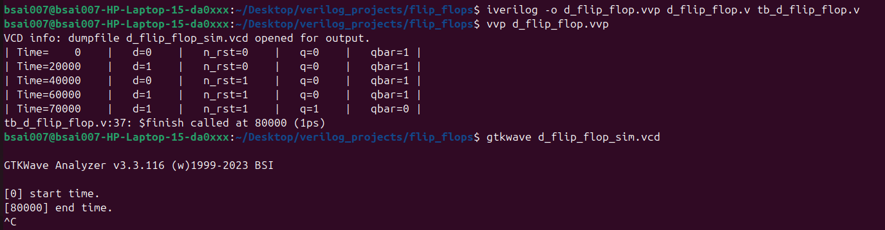
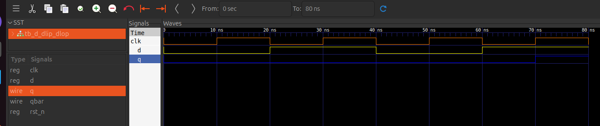
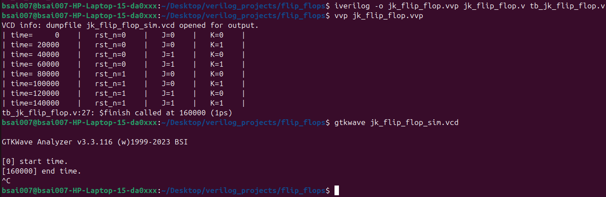
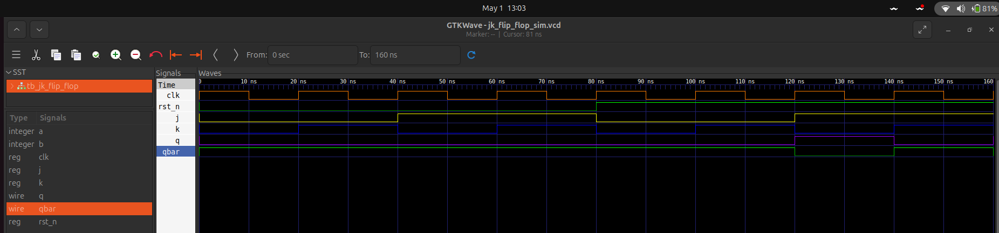

# FLIP FLOPS
## SR Flip Flop
    Initially implemented SR Flip FLOP.
    file location:-
    .
    └── flip_flops/
        ├── sr_flip_flop.v      # SR Flip-Flop RTL
        ├── tb_sr_flip_flop.v   # Self-checking Testbench
        

Equation: $Q_{next} = S + \overline{R} \cdot Q$
    
**Truth Table:**

| n_rst | S | R | Q | Notes |
| :---: | :---: | :---: | :---: | :--- |
|   1   | 1 | 0 | 1 | set(q=1)  |
|   1   | 0 | 0 | Q | hold      |
|   1   | 0 | 1 | 0 | reset(q=0)|
|   1   | 1 | 1 | x | invalid   | 
**SR Flip-Flop Implementation**
  * Uses non-blocking assignments (`<=`).
  * Includes an asynchronous active-low reset.
  * Verified using a 20ns clock period.
    * First rising edge at 10ns.
    * Reset released at 15ns.
* **Verification & Simulation:**
    * The design was verified using Icarus Verilog and GTKWave on a Linux environment.
    
* **Simulation Parameters:**
    * Clock Period: 20 ns (50 MHz).
    * Simulation Time: 85 ns total.
* **Waveform Analysis:**
    * Set: Output q transitions to high exactly at the 30 ns rising clock edge when s=1.
    * Reset: Output q transitions to low at the 50 ns rising edge when r=1.
    * Invalid State: When both s and r are driven high at 70 ns, the waveform correctly shows red hatching (X), representing an unknown/invalid state in hardware.

## **How to Run:**
    1. **Compile**: `iverilog -o sr_sim.vvp sr_flip_flop.v tb_sr_flip_flop.v`
    2. **Execute**: `vvp sr_sim.vvp`
    3. **View Waves**: `gtkwave sr_flip_flop_sim.vcd`

## **output**:
  * **Terminal output**:
    
  *  **GTKWAVE output**:
    


    
Next:- D flip flop
## D-Flip Flop
    All flip flop files are saved in same folder
    file location:-
    .
    └── flip_flops/
        ├── d_flip_flop.v      # D Flip-Flop RTL
        ├── tb_d_flip_flop.v   # Self-checking Testbench

The D (Data) Flip-Flop was implemented **structurally** by wrapping the existing SR Flip-Flop module. It uses an inverter to ensure that the $S$ and $R$ inputs are always complements, effectively eliminating the "Invalid State" ($S=1, R=1$) observed in the SR-FF.

**Equation**: $Q_{next} = D$

**Truth Table**:
| rst_n | D | clk | Q | Notes |
| :---: | :-: | :---: | :---: | :--- |
| 0 | X | X | 0 | Asynchronous Reset (Highest Priority) |
| 1 | 0 | $\uparrow$ | 0 | Reset state (Data = 0) |
| 1 | 1 | $\uparrow$ | 1 | Set state (Data = 1) |

### **Implementation Highlights**
* **Structural Wrapper**: Instantiates the verified `sr_flip_flop` module.
* **Complemented Inputs**: Maps $S = D$ and $R = \overline{D}$ to prevent forbidden states.
* **Asynchronous Logic**: Retains the active-low reset functionality from the base SR module.

### **Verification & Simulation**
* **Test Strategy**: Verified using a 4-pulse sequence (80ns total) to prove reset priority and edge-triggered behavior.
* **Waveform Analysis**:
  * **Reset Priority**: During the 2nd clock pulse (30ns), $D=1$ but `rst_n=0`. The output $Q$ correctly remained at `0`, proving the asynchronous reset overrides data.
  * **Edge Triggering**: At 70ns, $Q$ transitioned to `1` only upon the rising edge of the clock, confirming the design is positive-edge triggered.
  * **Logic Stability**: No "X" (Unknown) states were observed throughout the simulation.

### **How to Run**
1. **Compile**: 
   ```iverilog -o d_flip_flop.vvp d_flip_flop.v sr_flip_flop.v tb_d_flip_flop.v```
2. **RUN**    :```vvp d_flip_flop.v```
3. **View**   :```gtkwave d_flip_flop_sim.vcd```

## **output**:
  * **Terminal output**:
    
  *  **GTKWAVE output**:
    
    
Next:- JK flip flop

## JK Flip-Flop
The JK Flip-Flop is known as the "Universal Flip-Flop" because it resolves the invalid state of the SR-FF. When both $J$ and $K$ inputs are high, the output toggles (flips) its current state instead of becoming unknown.

**Equation**: $Q_{next} = J\overline{Q} + \overline{K}Q$

**Truth Table**:
| rst_n | J | K | clk | Q | Notes |
| :---: | :-: | :-: | :---: | :---: | :--- |
| 0 | X | X | X | 0 | Asynchronous Reset |
| 1 | 0 | 0 | $\uparrow$ | $Q_{prev}$ | Hold |
| 1 | 0 | 1 | $\uparrow$ | 0 | Reset |
| 1 | 1 | 0 | $\uparrow$ | 1 | Set |
| 1 | 1 | 1 | $\uparrow$ | $\overline{Q}_{prev}$ | **Toggle** |

### **Implementation Highlights**
* **Behavioral Modeling**: Implemented using an `always @(posedge clk)` block with a `case` statement to handle the four logic states.
* **Toggle Capability**: Successfully handles the $J=1, K=1$ condition by assigning `q <= ~q`.
* **Continuous Assignment**: The complementary output `qbar` is driven using a continuous `assign` statement (`assign qbar = ~q`).

### **Verification & Simulation**
* **Test Strategy**: Verified using nested `integer` loops to cycle through all 8 possible combinations of Reset, J, and K.
* **Waveform Analysis**:
  * **Asynchronous Reset (0-80ns)**: Proved `rst_n` priority; $Q$ remains `0` regardless of $J$ and $K$ values.
  * **Toggle Mode (150ns)**: When $\{J, K\} = 2'b11$, $Q$ transitioned from `1` to `0` at the rising clock edge.
  * **Frequency Division**: In toggle mode, the output $Q$ functions as a frequency divider, producing a square wave at half the frequency of the input clock.
* **Total Simulation Time**: 160 ns.

### **How to Run**
1. **Compile**: 
   ```bash
   iverilog -o jk_flip_flop.vvp jk_flip_flop.v tb_jk_flip_flop.v
   ```
2. **RUN**    :
    ```bash 
    vvp jk_flip_flop.v
    ```
3. **View**   :
    ```bash
    gtkwave jk_flip_flop_sim.vcd
    ```

## **output**:
  * **Terminal output**:
    
  *  **GTKWAVE output**:
    

