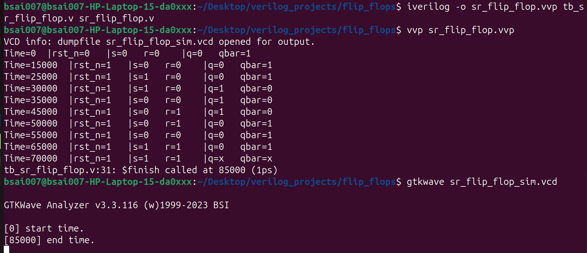
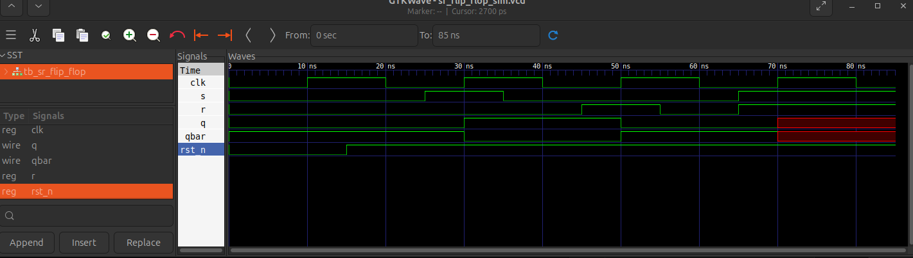

# FLIP FLOPS
## SR Flip Flop
    Initially implemented SR Flip FLOP.
    file location:-
    .
    └── flip_flops/
        ├── sr_flip_flop.v      # SR Flip-Flop RTL
        ├── tb_sr_flip_flop.v   # Self-checking Testbench
        

Equation: $Q_{next} = S + \overline{R} \cdot Q$
    
**Truth Table:**

| n_rst | S | R | Q | Notes |
| :---: | :---: | :---: | :---: | :--- |
|   1   | 1 | 0 | 1 | set(q=1)  |
|   1   | 0 | 0 | Q | hold      |
|   1   | 0 | 1 | 0 | reset(q=0)|
|   1   | 1 | 1 | x | invalid   | 
**SR Flip-Flop Implementation**
  * Uses non-blocking assignments (`<=`).
  * Includes an asynchronous active-low reset.
  * Verified using a 20ns clock period.
    * First rising edge at 10ns.
    * Reset released at 15ns.
* **Verification & Simulation:**
    * The design was verified using Icarus Verilog and GTKWave on a Linux environment.
    
* **Simulation Parameters:**
    * Clock Period: 20 ns (50 MHz).
    * Simulation Time: 85 ns total.
* **Waveform Analysis:**
    * Set: Output q transitions to high exactly at the 30 ns rising clock edge when s=1.
    * Reset: Output q transitions to low at the 50 ns rising edge when r=1.
    * Invalid State: When both s and r are driven high at 75 ns, the waveform correctly shows red hatching (X), representing an unknown/invalid state in hardware.

## **How to Run:**
    1. **Compile**: `iverilog -o sr_sim.vvp sr_flip_flop.v tb_sr_flip_flop.v`
    2. **Execute**: `vvp sr_sim.vvp`
    3. **View Waves**: `gtkwave sr_flip_flop_sim.vcd`

## **output**:
  * **Terminal output**:
    
  *  **GTKWAVE output**:
    

    
Next:- D flip flop
## D-Flip Flop
