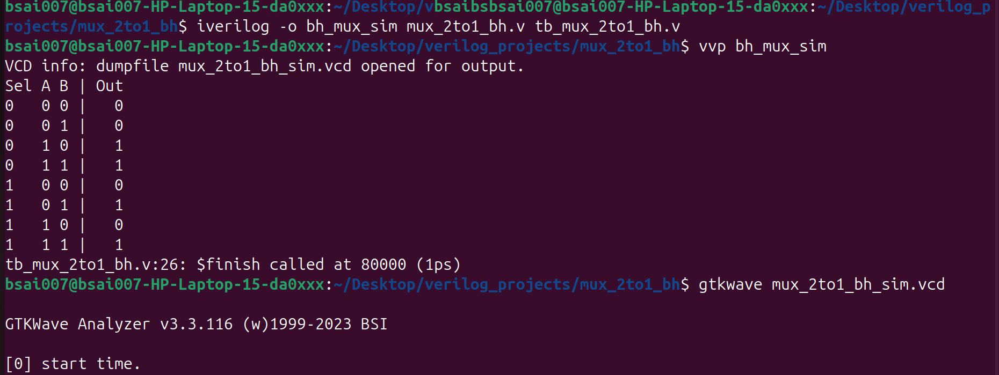
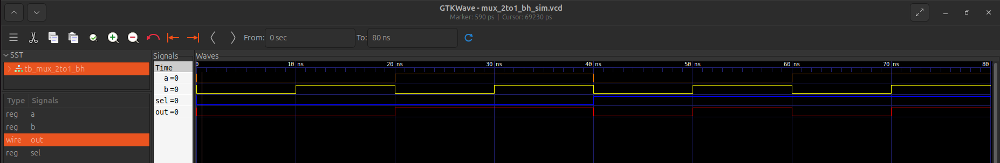

# 2:1 Multiplexer - Dataflow Modeling

## 🛠 Design Overview

### Logic Implementation
[cite_start]The design uses the standard Boolean equation for a 2:1 MUX[cite: 2]:
**Out = (A & ~Sel) | (B & Sel)[cite_start]** [cite: 2]

* **Inputs:** `a`, `b`, `sel` [cite: 1]
* [cite_start]**Output:** `out` [cite: 1]

## 📊 Simulation & Results
[cite_start]The design was verified using a testbench that cycles through all 8 binary combinations of the input signals [cite: 3, 6-9].

### 1. Terminal Output (Truth Table)
[cite_start]The terminal output confirms that the logic matches the expected truth table for every combination of `sel`, `a`, and `b`[cite: 5].

### 2. GTKWave Waveform
The waveform visualization shows the signal transitions over time.

* **0ns - 40ns (Sel = 0):** Output follows `a`.
* **40ns - 80ns (Sel = 1):** Output follows `b`.

## 🚀 How to Run
To reproduce these results:

1. Compile: `iverilog -o mux_sim mux_2to1_df.v tb_mux_2to1.v`
2. Run: `vvp mux_sim`
3. View Waveform: `gtkwave mux_2to1_df_sim.vcd`