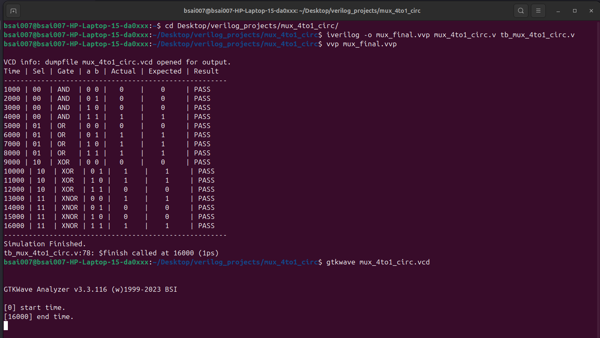
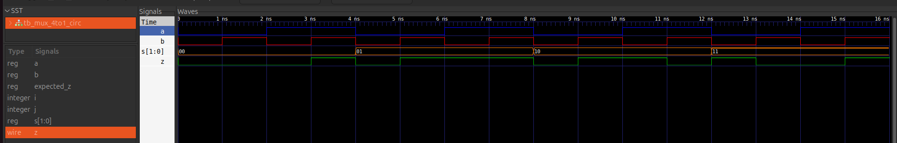

# 4-to-1 Multiplexer-Based Logic Gate Selector

## Description
This project implements a **4-to-1 Multiplexer (MUX)** in Verilog that functions as a logic gate selector. Based on a 2-bit select signal `s`, the circuit performs one of four bitwise operations on two input bits, `a` and `b`.

The project consists of:
* **`mux_4to1_circ.v`**: The RTL implementation using parallel logic gate assignments and a behavioral `case` statement for the MUX.
* **`tb_mux_4to1_circ.v`**: A testbench featuring nested loops and an automated checker to verify all 16 possible input combinations.

## Logic Mapping
The output `z` is determined by the select signal `s` as follows:

| Select (`s[1:0]`) | Operation | Logic Expression | Implementation |
| :--- | :--- | :--- | :--- |
| `00` | **AND** | $a \cdot b$ | `assign i0 = a & b;` |
| `01` | **OR** | $a + b$ | `assign i1 = a | b;` |
| `10` | **XOR** | $a \oplus b$ | `assign i2 = a ^ b;` |
| `11` | **XNOR** | $\overline{a \oplus b}$ | `assign i3 = ~(a ^ b);` |

## Verification & Results
The testbench uses a helper function, `get_gate_name`, to provide readable logs during simulation. It captures waveforms in a `.vcd` file using `$dumpfile` and `$dumpvars` for visual analysis in GTKWave.

### Terminal Output
The simulation results indicate that all test cases passed successfully.

### Waveform Analysis
The GTKWave output confirms the timing and logic behavior of the multiplexer across all select states.

## How to Run
1. **Compile**: `iverilog -o mux_final.vvp mux_4to1_circ.v tb_mux_4to1_circ.v`
2. **Execute**: `vvp mux_final.vvp`
3. **View Waves**: `gtkwave mux_4to1_circ.vcd`
