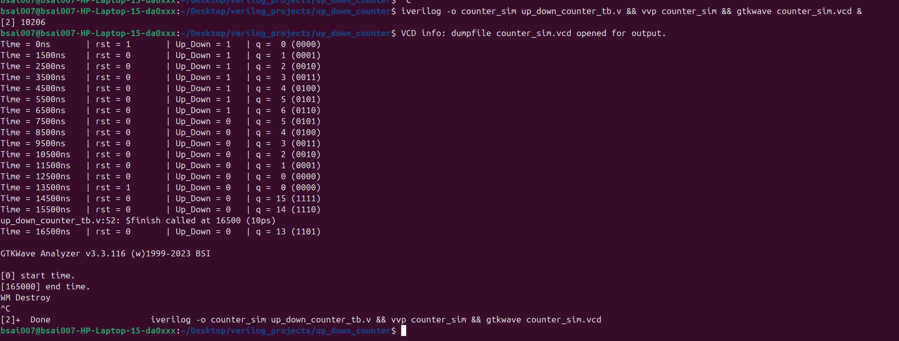
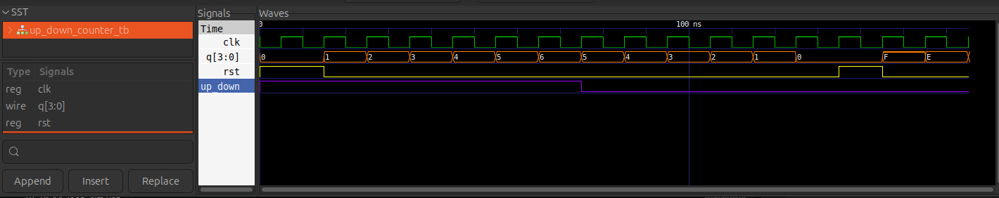

# Parameterized Up/Down Counter Pipeline

A parameterizable sequential logic implementation of an Up/Down Counter in Verilog HDL. The module supports variable bit-width configurations via architectural parameters, features asynchronous or synchronous active-high resets, and is fully verified natively on Ubuntu Linux using Icarus Verilog (`iverilog`) and GTKWave.

---

## 📂 Project Structure

```text
up_down_counter/
├── up_down_counter.v     # Parameterized RTL design module
└── up_down_counter_tb.v  # Testbench environment with parameter overrides
```

---

## ⚙️ Design Methodology

The design relies on a sequential hardware pipeline optimized for modular bit-width scaling.

### 1. Control & Counting Operation
* **Up-Counting State (`up_down = 1`):** On every rising edge of the clock (`clk`), the internal accumulator registers increment the output bus by `1'b1`.
* **Down-Counting State (`up_down = 0`):** The control path shifts logic networks, causing the output bus to decrement by `1'b1` on succeeding positive clock edges.
* **Overflow/Underflow Handling:** The counter naturally wraps around based on its parameterized boundary limits (e.g., a 4-bit counter wraps from `15` to `0` when counting up, or `0` to `15` when counting down).

### 2. Parameterization & Interface Mapping
The bit-width of the internal registers and structural output bus is controlled through the `Width` parameter:
* **Default Width:** 4-bit (`0` to `15` decimal space).
* **Testbench Override:** Can be expanded safely to 8-bit, 12-bit, or any arbitrary dimension (`Width = N`) by passing parameter overrides during instantiation without altering the source RTL code.

---

## 💻 RTL Hardware Implementation (`up_down_counter.v`)

```verilog
module up_down_counter #(
    parameter Width = 4
)(
    input wire clk,                  // Clock signal
    input wire rst,                  // Active-high reset signal
    input wire up_down,              // 1: Count Up, 0: Count Down
    output reg [Width-1:0] q         // Counter output bus
);

    always @(posedge clk or posedge rst) begin
        if (rst) begin
            q <= 0;                  // Dynamically clears all bits matching the Width
        end else begin
            if (up_down) begin
                q <= q + 1'b1;       // Increments accumulator register
            end else begin
                q <= q - 1'b1;       // Decrements accumulator register
            end
        end
    end

endmodule
```

---

## 🧪 Verification Environment (`up_down_counter_tb.v`)

This simulation testbench configures a 4-bit counter instance, generates stable clock phases, transitions through boundary values, flips counting direction, and dumps value changes.

```verilog
`timescale 1ns/100ps
`include "./up_down_counter.v"

module up_down_counter_tb;
    reg clk;
    reg rst;
    reg up_down;
    wire [3:0] count;

    // Instantiate a 4-bit instance of the counter by passing parameter overrides
    up_down_counter #(.Width(4)) dut (
        .clk(clk),
        .rst(rst),
        .up_down(up_down),
        .q(count)
    );

    // Generate a 10ns clock period (50MHz simulation clock frequency)
    always #5 clk = ~clk;

    initial begin
        // Setup GTKWave dump configurations
        $dumpfile("counter_sim.vcd");
        $dumpvars(0, up_down_counter_tb);

        // Initialize signals
        clk = 0;
        rst = 1;
        up_down = 1;

        // Release reset after initial cycles
        #15;
        rst = 0;
        
        // Count Up phase
        #60;
        
        // Switch control line to Count Down direction
        up_down = 0;
        #60;

        // Trigger reset to verify active clearing behavior
        rst = 1;
        #10;
        rst = 0;
        
        #20;
        $finish;
    end

    // Monitor value transitions in the terminal shell window
    initial begin
        $monitor("Time = %0tns | Reset = %b | Up_Down = %b | Count = %d (%b)", 
                 $time, rst, up_down, count, count);
    end

endmodule
```

---

## 🚀 Simulation & Verification Steps

This architecture is completely compiled and verified using the standard open-source Linux EDA toolchain.

### Compiling and Running the Simulation

Execute the sequential compilation, processing, and visual analysis commands in a single terminal line within your workspace directory:

```bash
iverilog -o counter_sim up_down_counter_tb.v && vvp counter_sim && gtkwave counter_sim.vcd &
```

---

## 💻 Expected Terminal Outputs

When running the compiled simulation binary via `vvp`, the console display monitor outputs track the counter state behavior sequentially. The terminal output image is shown for reference: 


Waveforms are shown in the image below:-




1. As you can see in the waveforms image, when rst is high, q is automatically 0.
2. when rst=0 and up_down=1, upcounter is started.
3. when up_down=0 and rst=0, down counter is started.
4. up_down=0 and rst=1, q=0.
5. rst =0 and updowwn=0 , since previous output is zero and it is 4 bit width, current output will be 4'b1111 and continues downwards in this configuration until any chnage in rst or up down will occur.
